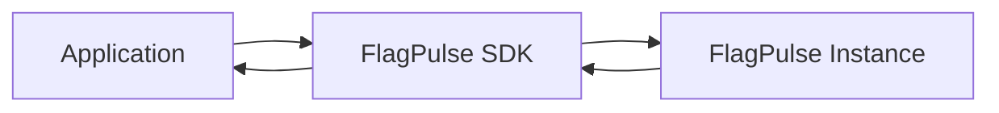

# FlagPulse SDKs

Official SDKs for integrating [FlagPulse](https://github.com/hitheshn208/flagpulse) feature flags into your applications.

FlagPulse provides a self-hosted feature flagging platform, while this repository contains the client-side SDKs used to connect applications to a FlagPulse instance.

## SDKs

| SDK            | Package               | Status | Documentation                         |
| -------------- | --------------------- | ------ | ------------------------------------- |
| React SDK      | `flagpulse-react-sdk` | Stable | [README](./flagpulse-react/README.md) |

> More SDKs may be added as the FlagPulse ecosystem grows.

## Architecture

The SDKs communicate with a FlagPulse instance to retrieve feature flag configurations and receive real-time updates.

Each SDK is maintained as an independent package with its own documentation, examples, API reference, and release cycle.

## Documentation

For complete information about FlagPulse, including self-hosting, configuration, API usage, and platform documentation:

**[FlagPulse Documentation](https://flagpulse.h208.me/)**

Replace the link above with the official FlagPulse documentation URL.

For SDK-specific installation and usage instructions, see the README inside the corresponding SDK directory.

## Contributing

Contributions to the FlagPulse SDK ecosystem are welcome.

Before contributing, please read the [Contributing Guide](./CONTRIBUTING.md) for development setup, repository conventions, pull request guidelines, and instructions for working on or adding SDKs.

## Related

* **FlagPulse** — [Core FlagPulse repository](https://github.com/hitheshn208/flagpulse)
* **Documentation** — [FlagPulse Documentation](#)
* **SDKs** — This repository
